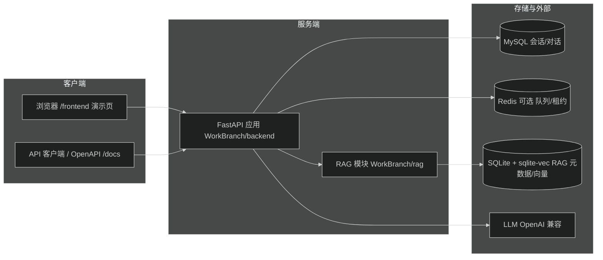

# AgentB

AgentB 是一个多会话 AI Agent 后端服务：提供会话/对话管理（SSE 流式执行）、工作区文件管理、计划管理、动态设置与 RAG 知识库检索增强等能力，并内置一套覆盖全部接口的 API 演示前端。

## 功能特性

- **会话与对话**：会话（Session）为顶层容器，对话（Conversation）为执行单元；对话支持 SSE 流式输出、取消、级联删除、断点续传（`last_seq` / `Last-Event-ID`）、`resume` 恢复被 `ask_user_question` 中断的对话。
- **工作区**：按 `workspace_id` 管理工作区，支持文件列表与 multipart 上传。
- **计划**：按工作区读写计划文件（内容、状态、删除）。
- **设置**：动态读取/局部更新配置，敏感字段自动脱敏，`"********"` 占位符可保留原值。
- **RAG**：知识库、分类树、文档（上传/检索/读取/重命名/删除）、入库与删除异步任务、兼容文件 CRUD。
- **API 演示前端**：纯静态单页，覆盖全部接口，零构建、由后端直接托管于 `/frontend`。
- **多实例部署**：支持 Nginx 一致性哈希路由 + Redis 会话归属租约（详见 [deploy/README.md](deploy/README.md)）。

## 技术栈

| 类别 | 选型 |
| --- | --- |
| 语言/框架 | Python 3.12、FastAPI、Pydantic v2 |
| 服务 | Uvicorn（开发）、Gunicorn + UvicornWorker（生产） |
| 数据库 | MySQL（会话/对话主存储）、SQLite + sqlite-vec（RAG 元数据/向量） |
| 队列/协调 | Redis（可选：消息队列、会话归属租约、RAG 任务队列） |
| 模型 | LLM（OpenAI 兼容接口，如 DashScope）；RAG 可选 embedding/OCR 依赖 |
| 前端 | 原生 HTML/CSS/JavaScript（静态托管） |

## 目录结构

```text
agentb/
├── WorkBranch/
│   ├── backend/            # FastAPI 主应用
│   │   ├── app.py          # 应用入口：路由挂载、中间件、静态前端托管
│   │   ├── controller/     # 会话/对话/工作区/计划/设置/用户 API
│   │   ├── service/        # 业务逻辑（agent_service、session_service 等）
│   │   ├── middleware/     # 鉴权、亲和性中间件
│   │   ├── frontend/       # API 演示前端（index.html / app.js / style.css）
│   │   └── .test/          # 单元/端到端测试
│   ├── rag/                # RAG 模块（controller/service/DAO/ingestion/ui）
│   ├── workspaces/         # 工作区数据（workspace.base_dir）
│   ├── tests/              # RAG 等 pytest 用例
│   ├── start-dev.bat       # 一键启动开发后端
│   └── run_dev.py          # 开发启动脚本
├── workspaces/             # 备用/兼容工作区目录
├── DOCS/                   # RAG 文档根目录（raw/ 为托管文件）
├── deploy/                 # 多实例部署（compose、nginx、e2e 冒烟脚本）
├── .dev/                   # 开发配置（setting.json）
├── .env.example            # 环境变量样例
├── .env.compose.example    # Compose 环境变量样例
├── Dockerfile              # 容器镜像
└── compose*.yml            # Compose 部署编排
```

## 架构概览



多实例部署时，Nginx 按一致性哈希把请求路由到多个单 worker API 实例；Redis 保存会话归属租约、心跳与可续传的对话流；MySQL 仍是会话/对话的唯一事实来源。RAG 入库仅由 `agentb-rag-worker` 执行。详见 [deploy/README.md](deploy/README.md)。

## 快速开始

### 环境要求

- Python 3.12+
- MySQL 8.x（会话/对话存储）
- Redis（可选，启用多实例/消息队列/会话租约时必需）
- LibreOffice（可选，用于 `.doc`/`.ppt` 上传与读取时转 `.docx`/`.pptx`）
- RAG 全功能（OCR/向量模型）需要 `requirements-rag.txt`

### 安装依赖

```bash
cd agentb
pip install -r requirements.txt
# 可选：RAG 完整依赖（easyocr/torch/sentence-transformers 等，体积较大）
pip install -r requirements-rag.txt
```

### 配置

1. 复制 `.env.example` 为 `.env`，按需修改：

   - `MYSQL_HOST` / `MYSQL_PORT` / `MYSQL_USER` / `MYSQL_PASSWORD` / `MYSQL_DATABASE`
   - `LLM_API_KEY` / `LLM_BASE_URL` / `LLM_MODEL`
   - `AGENTB_REDIS_URL`（可选）
   - `AUTH_DISABLED`（可选，`1` 时关闭鉴权）

2. LLM 与 Agent 行为参数也可在 `.dev/setting.json`（或部署时挂载的 `setting.json`）中配置：`llm`、`agent`、`workspace`、`mq`、`agent_tools` 等。

### 启动

```bash
cd WorkBranch
start-dev.bat            # Windows 一键启动
# 等价于：
python run_dev.py --host 127.0.0.1 --backend-port 8000
```

`run_dev.py` 参数：`--host`（默认 `127.0.0.1`）、`--backend-port`（默认 `8000`）、`--no-reload`。

### 验证

- 健康检查：`GET http://127.0.0.1:8000/health`
- 交互式 API 文档：`http://127.0.0.1:8000/docs`（OpenAPI：`/openapi.json`）
- API 演示前端：`http://127.0.0.1:8000/frontend/`

## 鉴权说明

- 除公开路径外，所有接口需要请求头 `X-User-ID`（整数），例如 `X-User-ID: 1`；中间件会把用户信息注入 `request.state.user`。
- 设置环境变量 `AUTH_DISABLED=1` 可关闭鉴权（此时默认用户为 `id=1, name=default_user`）。
- 公开路径（无需鉴权）：`/health`、`/health/ready`、`/router-health`、`/docs`、`/openapi.json`、`/rag`、`/rag/`、`/frontend`。
- 多实例部署下，业务写操作还需 `X-AgentB-Affinity-Key: <session_id>`；缺失返回 400，与库中会话不匹配返回 409，租约冲突返回 409 并带 `X-AgentB-Owner-ID`。

## API 概览（57 个接口）

交互式文档见 `/docs`；每个接口均可通过 `/frontend` 演示页直接调用。以下按模块列出全部接口。

### 健康检查 / 前端日志

| 方法 | 路径 | 说明 |
| --- | --- | --- |
| GET | `/health` | 健康状态、实例信息、资源使用、活跃任务 |
| GET | `/health/ready` | 就绪探针，排空期间返回 503 |
| POST | `/admin/drain` | 开始排空（拒绝新会话） |
| POST | `/api/logs` | 前端日志上报（同源校验，level/event 白名单） |
| POST | `/logs` | `/api/logs` 的别名接口 |

### 用户

| 方法 | 路径 | 说明 |
| --- | --- | --- |
| GET | `/user/profile` | 当前用户信息 |
| PUT | `/user/profile/name` | 修改当前用户昵称，请求体 `{name}` |

### 会话 Session

| 方法 | 路径 | 说明 |
| --- | --- | --- |
| GET | `/session/sessions` | 会话列表 |
| POST | `/session/sessions` | 创建会话，请求体 `{title}` |
| POST | `/session/sessions/{session_id}/title:generate` | 调用 LLM 生成会话标题 |
| GET | `/session/sessions/{session_id}` | 会话详情 |
| DELETE | `/session/sessions/{session_id}` | 删除会话（含全部对话） |
| GET | `/session/sessions/{session_id}/conversations` | 会话下的对话列表 |
| POST | `/session/sessions/{session_id}/conversations` | 创建对话，请求体 `{user_content / user_content_parts, idempotency_key?}` |

### 对话 Conversation

| 方法 | 路径 | 说明 |
| --- | --- | --- |
| GET | `/session/conversations/{conversation_id}` | 对话详情 |
| DELETE | `/session/conversations/{conversation_id}` | 删除单个对话 |
| POST | `/session/conversations/{conversation_id}/cancel` | 取消正在运行的对话 |
| DELETE | `/session/conversations/{conversation_id}/cascade` | 级联删除该对话及其后所有对话（回退） |
| POST | `/session/conversations/{conversation_id}/messages` | 准备消息（返回消息 ID，不执行 Agent） |
| GET | `/session/conversations/{conversation_id}/stream` | SSE 流式执行；`last_seq` 断点续传，`mode=interactive/silent` |
| POST | `/session/conversations/{conversation_id}/resume` | 恢复 `awaiting_user_input` 对话，请求体 `{answer, call_seq?}` |

流式接口说明：返回 `text/event-stream`，事件含 `id`（seq）与 `data`（JSON）；支持 `Last-Event-ID` 请求头续传；终止事件为 `done` / `error` / `cancelled`；静默模式只保留心跳与结束事件。

### 工作区 Workspace

| 方法 | 路径 | 说明 |
| --- | --- | --- |
| GET | `/workspaces` | 工作区列表 |
| GET | `/workspaces/{workspace_id}` | 工作区详情 |
| GET | `/workspaces/{workspace_id}/files` | 工作区文件列表 |
| POST | `/workspaces/{workspace_id}/files` | 上传文件（multipart：`files[]`、`sub_dir?`） |

### 计划 Plan

| 方法 | 路径 | 说明 |
| --- | --- | --- |
| GET | `/plan/{workspace_id}` | 读取计划内容与元信息 |
| POST | `/plan/update` | 更新计划，请求体 `{workspace_id, plan_content}` |
| GET | `/plan/{workspace_id}/status` | 计划状态 |
| DELETE | `/plan/{workspace_id}` | 删除计划文件 |

### 设置 Settings

| 方法 | 路径 | 说明 |
| --- | --- | --- |
| GET | `/api/settings` | 读取全部设置（敏感字段脱敏） |
| GET | `/api/settings/metadata` | 设置元数据 |
| PATCH | `/api/settings` | 局部更新设置，请求体为任意 JSON 对象 |

### RAG · 知识库

| 方法 | 路径 | 说明 |
| --- | --- | --- |
| GET | `/rag/api/knowledge-bases` | 知识库列表 |
| POST | `/rag/api/knowledge-bases` | 创建知识库，请求体 `{name, description?}` |
| PUT | `/rag/api/knowledge-bases/{kb_id}` | 更新知识库 `{name?, description?}` |
| DELETE | `/rag/api/knowledge-bases/{kb_id}` | 删除知识库 |

### RAG · 分类

| 方法 | 路径 | 说明 |
| --- | --- | --- |
| GET | `/rag/api/categories/tree` | 分类树 |
| POST | `/rag/api/categories` | 创建分类 `{name, parent_id?}` |
| PUT | `/rag/api/categories/{category_id}` | 更新分类 `{name?, parent_id?}` |
| DELETE | `/rag/api/categories/{category_id}` | 删除分类，query `mode=keep_docs/unbind_docs/recursive` |

### RAG · 文档

| 方法 | 路径 | 说明 |
| --- | --- | --- |
| POST | `/rag/api/documents/upload` | 上传文档（multipart：`file`、`category_id?`、`kb_id?`；上限 100MB，返回入库任务） |
| GET | `/rag/api/documents` | 分页查询 `category_id?/keyword?/page/size` |
| GET | `/rag/api/documents/{document_id}` | 文档详情 |
| GET | `/rag/api/documents/{document_id}/file` | 读取文档内容（Office 自动提取文本） |
| PUT | `/rag/api/documents/{document_id}` | 重命名文档 `{display_name}` |
| DELETE | `/rag/api/documents/{document_id}` | 删除文档（异步任务，返回 delete job） |
| GET | `/rag/api/delete-jobs/{job_id}` | 删除任务状态 |
| POST | `/rag/api/delete-jobs/{job_id}/retry` | 重试删除任务 |
| POST | `/rag/api/documents/{document_id}/categories/{category_id}` | 挂载文档到分类 |
| DELETE | `/rag/api/documents/{document_id}/categories/{category_id}` | 解除分类挂载 |
| PUT | `/rag/api/documents/{document_id}/primary-category/{category_id}` | 设置主分类 |
| GET | `/rag/api/jobs/{job_id}` | 入库任务状态 |

### RAG · 文件（兼容接口）

| 方法 | 路径 | 说明 |
| --- | --- | --- |
| GET | `/rag/api/files` | 按相对路径列出 `DOCS` 下文件 |
| GET | `/rag/api/file` | 读取文件（已废弃，请改用文档接口） |
| POST | `/rag/api/file` | 创建文件/目录 `{path, type, content?, overwrite?}` |
| PUT | `/rag/api/file` | 覆盖文件内容 `{path, content}` |
| DELETE | `/rag/api/file` | 删除文件/目录（query `path`） |

## API 演示前端

后端启动后访问 `http://127.0.0.1:8000/frontend/`：

- 左侧按模块列出全部 57 个接口，支持搜索；
- 每个接口有独立参数表单（路径参数、查询参数、JSON 请求体、multipart 文件上传）；
- 发送后展示状态码、耗时与原始响应 JSON；
- SSE 接口逐条展示流式事件，可手动停止；
- 删除、排空等破坏性操作需二次确认；
- 顶部可切换 `Base URL` 与 `X-User-ID`（默认 `1`）。

## 配置详解（setting.json）

关键配置段（`.dev/setting.json` / 部署挂载的 `/app/setting.json`）：

- `database.path`：SQLite 数据库路径（会话存储）。
- `llm`：`api_key`、`base_url`、`model`、`temperature`、`max_tokens`、`fast_model` 等。
- `workspace.base_dir`：工作区根目录。
- `mq.max_size`：内存消息队列大小。
- `agent`：编排版本（`orchestration_version`）、工具并行度、超时、`ask_user_auto_approve`、等待用户输入超时等。
- `agent_tools`：SQL 数据库连接、PDF 解析、外部 API 地址（facility_report/dailypatrol/ai_judgment）等。

环境变量优先级：非空环境变量（如 `LLM_*`）覆盖 `setting.json` 中的对应值；部署模式两者兼容。

## 测试

```bash
# 单元测试（无需启动后端）
cd WorkBranch/backend
python .test/run_unit_tests.py

# 端到端测试（需后端已启动）
python .test/run_e2e_tests.py

# RAG 相关 pytest 用例
cd agentb
pytest WorkBranch/tests
```

## 部署

- 镜像构建：`Dockerfile`（Python 3.12-slim，可选安装 LibreOffice 与 RAG 依赖）。
- 生产服务：Gunicorn + UvicornWorker，配置见 `WorkBranch/backend/gunicorn.conf.py`（默认绑定 `0.0.0.0:8000`）。
- 单机模式：`docker compose --env-file .env.compose -f compose.yml -f compose.standalone.yml up -d`，默认仅发布 `127.0.0.1:8152`。
- 平台模式：`docker compose --env-file .env.compose -f compose.yml -f compose.platform.yml up -d`，由平台代理转发到 `agentb-router:8080`。
- 多实例拓扑：Nginx 一致性哈希 + 3 个单 worker API 实例 + RAG worker；Redis 存储会话租约/心跳/流；MySQL 为事实来源。
- 完整部署、升级、回滚与运维说明见 [deploy/README.md](deploy/README.md)。

## 运维要点

- 健康检查：`/health`（详情）、`/health/ready`（就绪，排空时 503）。
- 排空下线：对目标实例 `POST /admin/drain`，等待 `/health` 显示 `active_tasks: 0` 后再摘除路由。
- 备份：MySQL、`agentb-rag-data`、`agentb-rag-docs`、`agentb-workspaces` 卷、Redis AOF。
- 回滚：排空新实例，`deploy/nginx/agentb.conf` 暂时只保留一个健康上游；不要在多容器间共享 SQLite MQ 文件。

## 常见问题

| 现象 | 处理 |
| --- | --- |
| 接口返回 401 | 缺少或非法的 `X-User-ID`；或确认该路径是否属于公开路径 |
| 对话流不输出 | 检查 `/health` 与 MySQL/Redis 连通性；流式接口可传 `mode=silent` 验证链路 |
| 上传后检索不到 | 查询 `/rag/api/jobs/{job_id}` 确认入库任务状态，检查文档是否绑定知识库/分类 |
| 上传 413 | 单文件超过 100MB 上限 |
| 404 / 409 | 资源不存在 / 名称冲突或唯一约束冲突 |
| RAG 依赖报错 | 未安装 `requirements-rag.txt`（`sqlite_vec`、OCR/向量模型等） |

## 相关文档

- [deploy/README.md](deploy/README.md)：多实例部署、亲和性契约、运维
- [WorkBranch/rag/README.md](WorkBranch/rag/README.md)：RAG 模块说明
- `WorkBranch/backend/.test/`：单元/端到端测试
