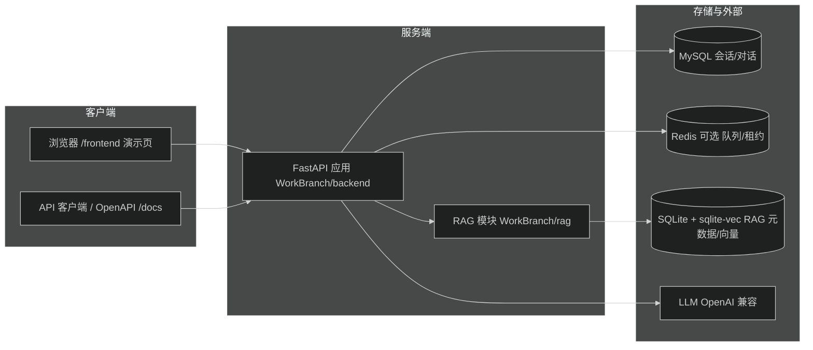

# AgentB

AgentB 是一个多会话 AI Agent 后端服务：提供会话/对话管理（SSE 流式执行）、工作区文件管理、计划管理、动态设置与 RAG 知识库检索增强等能力，并内置一套覆盖全部接口的 API 演示前端。

## 功能特性

- 会话与对话：SSE 流式输出、取消、级联删除、断点续传（`last_seq` / `Last-Event-ID`）、`resume` 恢复被中断的对话。
- 工作区 / 计划 / 设置：按 `workspace_id` 管理文件，读写计划，动态读取/局部更新配置（敏感字段自动脱敏）。
- RAG：知识库、分类树、文档上传/检索/读取，异步入库与删除任务。
- API 演示前端：覆盖全部接口的调用演示页，部署后浏览器直接打开即可试用，零构建、由后端托管于 `/frontend`。
- 多实例部署：Nginx 一致性哈希路由 + Redis 会话归属租约（详见 [deploy/README.md](deploy/README.md)）。

## 技术栈

| 类别 | 选型 |
| --- | --- |
| 语言/框架 | Python 3.12、FastAPI、Pydantic v2 |
| 服务 | Uvicorn（开发）、Gunicorn + UvicornWorker（生产） |
| 数据库 | MySQL（会话/对话主存储）、SQLite + sqlite-vec（RAG 元数据/向量） |
| 队列/协调 | Redis（可选：消息队列、会话归属租约、RAG 任务队列） |
| 模型 | LLM（OpenAI 兼容接口，如 DashScope）；RAG 可选 embedding/OCR 依赖 |
| 前端 | 原生 HTML/CSS/JavaScript（静态托管，`/frontend`） |

## 目录结构

```text
agentb/
├── WorkBranch/
│   ├── backend/            # FastAPI 主应用
│   │   ├── app.py          # 应用入口：路由挂载、中间件、静态前端托管
│   │   ├── controller/     # 会话/对话/工作区/计划/设置/用户 API
│   │   ├── service/        # 业务逻辑（agent_service、session_service 等）
│   │   ├── middleware/     # 鉴权、亲和性中间件
│   │   ├── frontend/       # API 演示前端（index.html / app.js / style.css）
│   │   └── .test/          # 单元/端到端测试
│   ├── rag/                # RAG 模块（controller/service/DAO/ingestion/ui）
│   ├── workspaces/         # 工作区数据（workspace.base_dir）
│   ├── tests/              # RAG 等 pytest 用例
│   ├── start-dev.bat       # 一键启动开发后端
│   └── run_dev.py          # 开发启动脚本
├── workspaces/             # 备用/兼容工作区目录
├── DOCS/                   # RAG 文档根目录（raw/ 为托管文件）
├── deploy/                 # 多实例部署（compose、nginx、e2e 冒烟脚本）
├── .dev/                   # 开发配置（setting.json）
├── .env.example            # 环境变量样例
├── .env.compose.example    # Compose 环境变量样例
├── Dockerfile              # 容器镜像
└── compose*.yml            # Compose 部署编排
```

## 架构概览



多实例部署时，Nginx 按一致性哈希把请求路由到多个单 worker API 实例；Redis 保存会话归属租约、心跳与可续传的对话流；MySQL 仍是会话/对话的唯一事实来源。RAG 入库仅由 `agentb-rag-worker` 执行。详见 [deploy/README.md](deploy/README.md)。

## 快速开始（开发模式）

### 环境要求

- Python 3.12+
- MySQL 8.x（库与表在启动时自动创建，账号只需有建库权限）
- Redis（可选，多实例/消息队列/会话租约时需要）
- LibreOffice（可选，`.doc`/`.ppt` 上传与读取时转格式用）
- RAG 全功能需要 `requirements-rag.txt`（OCR/向量模型，体积较大）

### 安装依赖

```bash
python3 -m venv .venv
.venv/bin/pip install -r requirements.txt
# 可选：RAG 完整依赖
.venv/bin/pip install -r requirements-rag.txt
```

### 配置

1. 复制 `.env.example` 为 `.env`，修改 `MYSQL_HOST` / `MYSQL_PORT` / `MYSQL_USER` / `MYSQL_PASSWORD` / `MYSQL_DATABASE` 与 `LLM_API_KEY` / `LLM_BASE_URL` / `LLM_MODEL`。
2. Agent 行为参数可在 `.dev/setting.json` 中配置（`llm`、`agent`、`workspace`、`mq`、`agent_tools` 等）；非空环境变量优先于 setting.json。

### 启动

```bash
cd WorkBranch
../.venv/bin/python run_dev.py --host 0.0.0.0 --backend-port 8000 --no-reload
```

`run_dev.py` 参数：`--host`（默认 `127.0.0.1`）、`--backend-port`（默认 `8000`）、`--no-reload`。

### 验证

- 健康检查：`GET http://127.0.0.1:8000/health`
- API 文档：`http://127.0.0.1:8000/docs`（OpenAPI：`/openapi.json`）
- API 演示前端：`http://127.0.0.1:8000/frontend/`

## 部署（生产）

### 方式一：Docker Compose（推荐）

1. 安装 Docker Engine 与 Compose 插件。
2. 复制 `.env.compose.example` 为 `.env.compose`，修改 `MYSQL_PASSWORD` / `MYSQL_ROOT_PASSWORD` 与 `LLM_API_KEY` / `LLM_BASE_URL` / `LLM_MODEL`（`LLM_*` 留空时使用 `AGENTB_SETTING_FILE` 指向的 setting.json，默认 `./.dev/setting.json`）。
3. 启动单机模式（默认仅发布 `127.0.0.1:8152`，MySQL/Redis 只在 Compose 网络内）：

```bash
docker compose --env-file .env.compose -f compose.yml -f compose.standalone.yml up -d --build
```

4. 验证：

```bash
curl http://127.0.0.1:8152/router-health
curl http://127.0.0.1:8152/api/health
docker compose -f compose.yml -f compose.standalone.yml ps
```

5. 平台模式（由平台代理转发，不发布宿主端口）：

```bash
docker compose --env-file .env.compose -f compose.yml -f compose.platform.yml up -d --build
```

需在 `.env.compose` 设置 `AGENTB_PLATFORM_NETWORK`（指向已存在的 Docker 网络）；上游代理访问 `http://agentb-router:8080`。

> 端口被占用时，在 `.env.compose` 中修改 `AGENTB_PORT`。

### 方式二：Linux 裸机（无 Docker）

1. 安装 Python 3.12、MySQL 8.x（库/表启动时自动创建）、可选 Redis 与 LibreOffice。
2. 安装依赖（`gunicorn`/`psutil` 不在 requirements.txt 中，需单独安装）：

```bash
python3 -m venv .venv
.venv/bin/pip install -r requirements.txt
.venv/bin/pip install gunicorn psutil
```

3. 配置：`cp .env.example .env`，修改 `MYSQL_*` 与 `LLM_*`。
4. 生产启动（Gunicorn + UvicornWorker，默认绑定 `0.0.0.0:8000`）：

```bash
export VENV=$PWD/.venv
export PYTHONPATH=$PWD/WorkBranch/backend:$PWD/WorkBranch
cd WorkBranch/backend
$VENV/bin/gunicorn app:app -c gunicorn.conf.py
```

5. RAG worker（另开一个进程执行入库任务）：

```bash
cd WorkBranch
../.venv/bin/python -m rag.worker
```

6. 生产环境建议用 systemd 托管上述两个进程（`Restart=always`），日志由 Gunicorn 输出到 stdout/stderr。

### 运维要点

- 健康检查：`/health`（详情）、`/health/ready`（就绪，排空时返回 503）。
- 下线实例：`POST /admin/drain`，等待 `/health` 显示 `active_tasks: 0` 后再摘除路由。
- 备份：MySQL、`agentb-workspaces` / `agentb-rag-data` / `agentb-rag-docs` 卷、Redis AOF。
- 升级/回滚：详见 [deploy/README.md](deploy/README.md)。

## 查看 API 前端（全量接口预览）

部署完成后直接用浏览器打开以下地址即可查看并试用全部接口：

- Docker 单机模式：`http://127.0.0.1:8152/frontend/`
- 裸机模式：`http://127.0.0.1:8000/frontend/`

页面说明：

- 覆盖全部接口：左侧按模块列出接口并支持搜索，每个接口有独立参数表单（路径/查询参数、JSON 请求体、multipart 上传）。
- SSE 接口逐条展示流式事件，可手动停止；删除、排空等破坏性操作需二次确认。
- 顶部可切换 `Base URL` 与 `X-User-ID`（默认 `1`）。
- 接口清单与字段定义另见 OpenAPI 文档 `/docs`（JSON：`/openapi.json`）。

## 鉴权说明

- 除公开路径外，所有接口需要请求头 `X-User-ID`（整数），中间件会把用户信息注入 `request.state.user`。
- 设置 `AUTH_DISABLED=1` 可关闭鉴权（默认用户 `id=1, name=default_user`）。
- 多实例部署下，业务写操作还需 `X-AgentB-Affinity-Key: <session_id>`，缺失返回 400，租约冲突返回 409；契约详见 [deploy/FRONTEND_AFFINITY.md](deploy/FRONTEND_AFFINITY.md)。

## 配置详解（setting.json）

- `database.path`：SQLite 数据库路径。
- `llm`：`api_key`、`base_url`、`model`、`temperature`、`max_tokens`、`fast_model` 等。
- `workspace.base_dir`：工作区根目录。
- `mq.max_size`：内存消息队列大小。
- `agent`：编排版本、工具并行度、超时、`ask_user_auto_approve` 等。
- `agent_tools`：SQL 数据库连接、PDF 解析、外部 API 地址等。

非空环境变量（如 `LLM_*`）优先于 setting.json 中的对应值。

## 测试

```bash
# 单元测试（无需启动后端）
cd WorkBranch/backend
python .test/run_unit_tests.py

# 端到端测试（需后端已启动）
python .test/run_e2e_tests.py

# RAG 相关 pytest 用例
pytest WorkBranch/tests
```

## 常见问题

| 现象 | 处理 |
| --- | --- |
| 接口返回 401 | 缺少或非法的 `X-User-ID`；或确认该路径是否属于公开路径 |
| 对话流不输出 | 检查 `/health` 与 MySQL/Redis 连通性；流式接口可传 `mode=silent` 验证链路 |
| 上传后检索不到 | 查询 `/rag/api/jobs/{job_id}` 确认入库任务状态 |
| 上传 413 | 单文件超过 100MB 上限 |
| RAG 依赖报错 | 未安装 `requirements-rag.txt`（`sqlite_vec`、OCR/向量模型等） |

## 相关文档

- [deploy/README.md](deploy/README.md)：多实例部署、亲和性契约、运维
- [deploy/FRONTEND_AFFINITY.md](deploy/FRONTEND_AFFINITY.md)：前端会话归属字段生命周期
- [WorkBranch/rag/README.md](WorkBranch/rag/README.md)：RAG 模块说明
- `WorkBranch/backend/.test/`：单元/端到端测试